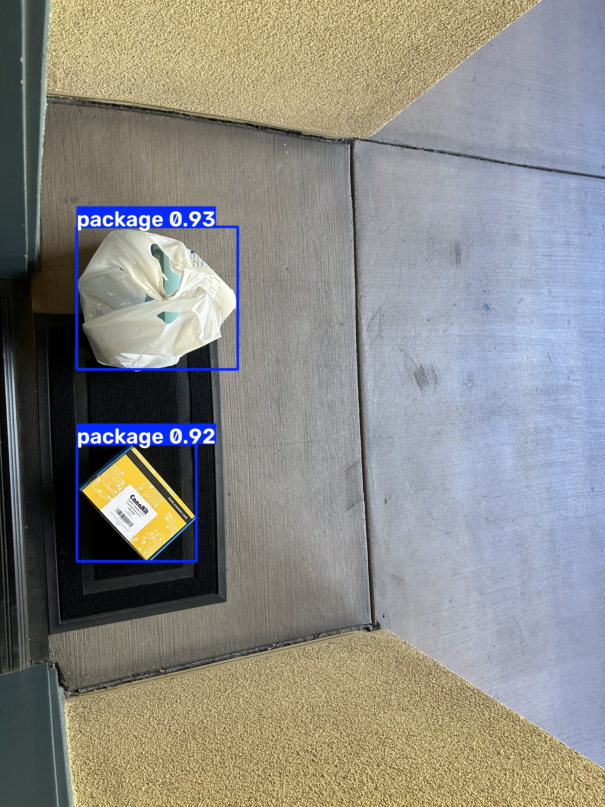
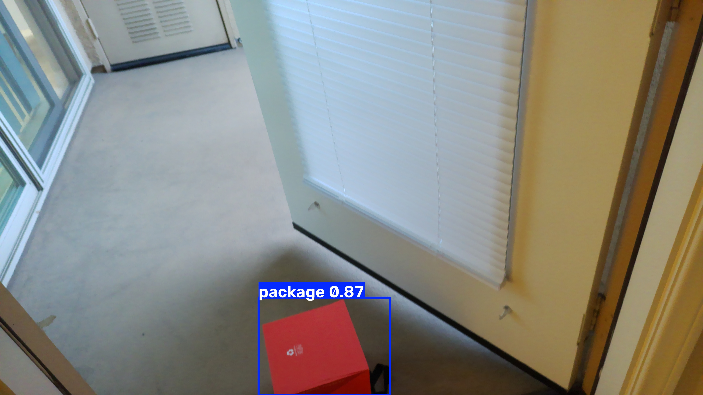

# Project Doorstep — a physical AI package detector

A Raspberry Pi 5, a top-down camera, and a fine-tuned YOLOv8 model that watches
my doorstep, figures out when a package arrives or gets picked up, and sends
me a Telegram message with a photo — all running locally, no cloud inference,
no subscription.

## Why I built this

Packages kept getting stolen off my doorstep, and I wanted a way to know the
moment something arrived — not find out hours later when it was already gone.
Commercial "smart doorbell" solutions exist, but they're subscription-gated,
cloud-dependent, and capture far more than they need to (your face, your
neighbors, anyone walking by).

I'd spent time working on proof-of-delivery systems at Walmart, which meant
working closely with PII (personally identifiable information) handling and
minimization — architecture decisions there were shaped by not capturing more
personal data than a system actually needed. That instinct followed me into
this project without my consciously deciding to apply it each time. The
camera is mounted top-down specifically so it never captures faces or
identifiable people, even accidentally — a decision I made for privacy
reasons first, then found a second, practical reason for later (see
[Technical Decisions](#technical-decisions) below).

This was also my first from-scratch physical AI project — zero prior coding
experience going in. Everything from flashing the SD card to fine-tuning a
computer vision model was learned by doing, with a lot of real failures along
the way. This README doesn't hide those.

**Status:** this is a completed learning project, not a permanently deployed
system — it doesn't run live at my door today. See
[Deliberate Scope Decisions](#deliberate-scope-decisions) for what's
intentionally left out and what real deployment would require.

## What it actually does



1. A camera mounted above the doorstep takes a photo every 30 seconds.
2. A YOLOv8 model — fine-tuned specifically on package photos, not the
   generic pretrained version — detects how many packages are in frame.
3. That count is compared to the last saved count. If it went up, a package
   arrived. If it went down, one was picked up. If it's unchanged, nothing
   happens — silently.
4. On a real change, I get a Telegram message with the actual photo attached,
   not just a text alert.



## Architecture

```
Pi Camera (top-down mount)
        │
        ▼
  Capture a photo (picamera2)
        │
        ▼
  Fine-tuned YOLOv8 nano model (package_v2_best.pt)
        │  → outputs: how many "package" objects, and how confident it is
        ▼
  Compare to last saved count (package_state.json)
        │  → arrived / arrived again / picked up / no change
        ▼
  If it's a real event: send a Telegram message (photo + caption)
        │
        ▼
  Wait 30 seconds, repeat
```

**In plain terms, for a non-ML reader:** the model isn't "smart" the way a
person is — it's a pattern-matcher that was shown thousands of labeled
example photos of packages and learned to recognize similar shapes/textures
again. It outputs a confidence score (0-100%) for each thing it thinks might
be a package. The system only trusts a detection if that score clears a
threshold we chose deliberately (more on that below) — below that, it's
treated as "probably nothing."

The three files that make up the live system:

| File | Role |
|---|---|
| `pi_continuous_monitor.py` | The entry point. Captures from the Pi camera, runs the check loop. |
| `monitor_check.py` | The core logic: detect → compare to saved state → decide the event → notify. |
| `telegram_notify.py` | Sends the Telegram message (photo + caption). |

## Technical decisions — and the real reasoning behind them

**Top-down camera angle.** Chosen primarily for privacy — it structurally
can't capture faces or bystanders. It turned out to have a second, practical
benefit I didn't originally plan for: early testing with a normal-angle
webcam showed the model would misidentify a person's arm/torso holding a
package as *"person"* (85% confidence) and completely ignore the actual
package in their hand. A top-down angle removes limbs and faces from frame
entirely, which sidesteps that failure mode too.

**Fine-tuning instead of the stock model.** The pretrained YOLOv8 nano model
(trained on the general-purpose COCO dataset) has no concept of "package" as
a category — it doesn't just mislabel packages, it frequently fails to
notice them at all, at any confidence level. A cardboard box would get
misread as "book," "bed," or "couch" depending on angle, or missed entirely.
Fixing this meant fine-tuning the model specifically on package images.

**Why not just use a bigger model or a lower threshold?** Both were my first
instinct when detection failed, and both turned out to be the same mistake
wearing different clothes: reaching for more power the moment something
underperforms, without asking what it actually costs or whether it fixes the
real problem. A bigger model can't run fast enough on Pi-class hardware, and
a lower threshold can't rescue a detection that never fired in the first
place. The actual fix was more/better training data.

**Confidence threshold: 0.5.** Chosen deliberately on the loose side. Based
on the validation set, 94.5% of images had their best detection score above
0.5. The reasoning: a false alarm (an unnecessary notification) costs you a
two-second glance at your phone. A missed real package defeats the entire
purpose of the project. Given that asymmetry, erring toward "notify more
readily" is the correct tradeoff here, not a compromise.

**Choosing not to use the neighborhood WhatsApp group's photos.** While
collecting training images, I found a community WhatsApp group where
neighbors post package/lost-item photos — readily available, highly
realistic training data. I passed on it. That data was shared for a
different purpose than model training, and using it that way didn't sit
right — the same PII-minimization instinct from my Walmart work, showing up
again without my deliberately deciding to apply it. I used my own photos,
stock images, and photos from opted-in friends/family instead.

## Real results

The honest before/after:

| | v1 fine-tune (110 images) | v2 fine-tune (9,555 images) |
|---|---|---|
| Precision | 0.521 | **0.873** |
| Recall | 0.697 | **0.785** |
| mAP50 | 0.696 | **0.875** |
| **Real-world max detection confidence** | **5.5%** (technically "learned something," practically unusable) | **93% median**, 94.5% of validation images above 50% |

The gap between those two rows is the actual story of this project. The v1
model had a decent-looking mAP50 score on paper, but every real detection it
produced topped out around 5.5% confidence — nowhere close to usable at any
sane threshold. It had learned a faint *ranking* signal (the correct
location scored marginally higher than background) but hadn't learned to be
confident. That's a realistic outcome for fine-tuning on only 110 images,
not a bug. Scaling to a 9,555-image consolidated dataset closed that gap
entirely — median detection confidence went from unusable to genuinely
trustworthy.

## Real challenges, and how they were actually solved

**A stuck microSD card.** Inserted wrong-side into the adapter during initial
Pi setup, and it jammed. Fixed by cutting a thin rigid plastic strip,
applying folded double-sided tape, sliding it in above the card, and slowly
pulling it free without damaging the pins or the already-written OS.
Hardware mistakes can't be undone like a software bug — you problem-solve
with your hands, with real risk of loss.

**Camera not detected — a cable orientation issue, on both ends.** The
Raspberry Pi 5's camera port has the *opposite* ribbon cable orientation
convention from older Pi models. Diagnosed via kernel logs (`dmesg` showed
no sensor at all) and an I2C bus scan — a scan showing *every* address
respond turned out to be the signature of a floating, disconnected bus, not
real hardware. The fix required the correct orientation on *both* ends: the
Pi-side connector needs contacts facing the Ethernet port, the
camera-module-side connector needs contacts facing the camera's own board —
opposite of each other, confirmed against official documentation rather
than guessed.

**27 different class names for one real-world object.** A merged dataset
pulled from multiple public Roboflow Universe sources used inconsistent
labels for the same thing — `Box`, `cardboard`, `Parcel`, `opened_box`,
`Package`, and 22 more variants, all meaning "package." Training on that
directly would have fragmented the learning signal across 27 artificial
categories instead of one real one. Solved with a script
(`archive/remap_classes_to_package.py`) that rewrote every label file's
class ID to a single unified class, verified with visual spot-checks
(`training images/spot_check/`) before trusting the result.

**No local GPU.** Training on a CPU-only laptop was timed at ~42 minutes
*per epoch* on the full dataset — a 100-epoch run would have taken 14-70+
hours. Moved training to Google Colab's free GPU tier instead, completing
all 100 epochs in ~4.5 hours. Sometimes the fix for "this doesn't work"
isn't a smarter approach — it's more of the unglamorous stuff (more data,
more compute).

## Deliberate scope decisions

**The monitoring loop is bounded, not infinite — on purpose.**
`pi_continuous_monitor.py` currently runs for a fixed, small number of
cycles rather than running forever. This is an intentional scope boundary
for where this project currently stands (a demo/learning project), not an
oversight. Converting it into a true always-on system — running
indefinitely, likely as a proper system service (e.g. a `systemd` unit on
the Pi, with restart-on-crash and boot-time startup) — is the natural next
step for permanent deployment, and is explicitly out of scope for this
version.

**The `training images/` folder name has a space in it.** Known, and left
alone deliberately. Every reference to it in code goes through Python's
`Path()` or properly quoted shell commands, so it's never actually caused a
bug — renaming it would require also renaming it on the deployed Pi and
re-validating the live path, for a purely cosmetic gain.

## What this project actually involved

Beyond "trained a model":

- **Hardware debugging without guessing** — tracing a non-detected camera
  down to the I2C bus level, fixes verified against official documentation.
- **Dataset engineering** — consolidating a 27-class, multi-source,
  inconsistently-labeled dataset into one the model could actually learn
  from, verified visually before trusting it.
- **Spotting a real ML failure mode**: a decent-looking aggregate metric
  (mAP50) can hide a model that's practically useless, because that metric
  doesn't capture whether individual predictions are confident enough to
  act on. Catching that required looking past the headline number into raw
  per-detection confidence.
- **Cost/benefit discipline over reflexive "make it smarter."**
- **End-to-end systems integration** — camera, CPU-only inference, stateful
  comparison logic, and a real external notification API, wired together
  and tested live.
- **Privacy-conscious design as a default**, applied to both the camera's
  framing and the data sourcing decisions.

## Running this yourself

**Hardware needed:**
- Raspberry Pi 5
- Raspberry Pi Camera Module 3 (CSI-connected)
- A mount positioning the camera top-down over the area you want monitored

**Software setup on the Pi:**
```bash
python3 -m venv doormat-venv
source doormat-venv/bin/activate  # or the Windows equivalent if testing off-Pi
pip install ultralytics opencv-python picamera2 python-dotenv requests
```

**The model file is already included in this repo** —
`training images/models/package_v2_best.pt` — no retraining required to run
the system as-is.

**Telegram setup (you provide your own):**
1. Create a bot via [@BotFather](https://t.me/BotFather) on Telegram, get
   your bot token.
2. Create a `.env` file in the project root:
   ```
   TELEGRAM_BOT_TOKEN=your_token_here
   TELEGRAM_CHAT_ID=your_chat_id_here
   ```
3. Message your bot once on Telegram, then use `archive/get_telegram_chat_id.py`
   to discover your chat ID.

**Run it:**
```bash
python pi_continuous_monitor.py
```

`.env` is gitignored and never committed — you'll need to create your own.

## Repo layout

- `pi_continuous_monitor.py`, `monitor_check.py`, `telegram_notify.py` — the
  live system.
- `tests/` — regression tests and the script that produced the validation
  metrics above.
- `archive/` — earlier iterations and one-time setup/data-prep scripts, kept
  for the record rather than deleted. A few worth a look if you're curious
  about the journey specifically: `remap_classes_to_package.py` (the
  27-class consolidation), `train_package_detector.py` (the v1 attempt that
  motivated the whole rework), and `get_telegram_chat_id.py` (the Telegram
  onboarding helper).
- `docs/demo_images/` — a curated handful of images spanning the project's
  arc, referenced above.
- `training images/` — dataset and model artifacts. The full dataset (9,555
  images, ~1.3GB) and full validation output (~766MB) are not included in
  this repo due to size; they live on the author's local machine and Google
  Drive backup. What *is* included: the final model weights, the real
  training metrics (`results.csv`, `args.yaml`), and a small dataset
  spot-check sample.
- `session-log.md` — a running, timestamped build log kept throughout the
  project, more granular than this README.
